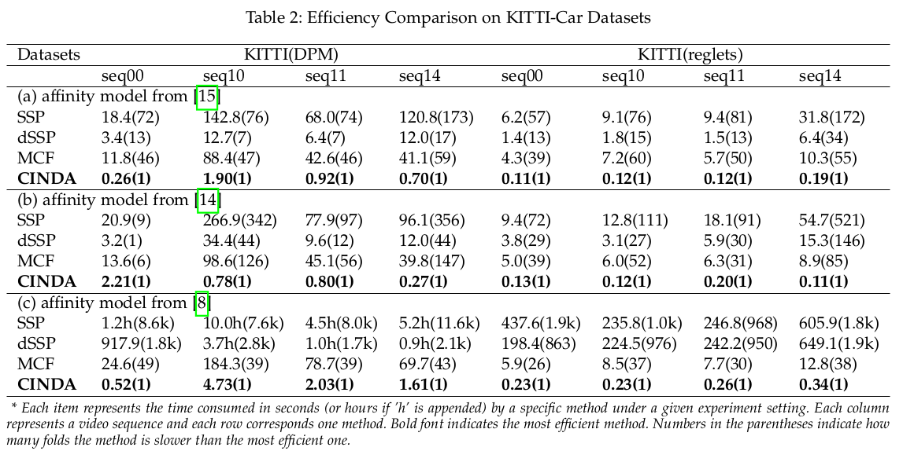
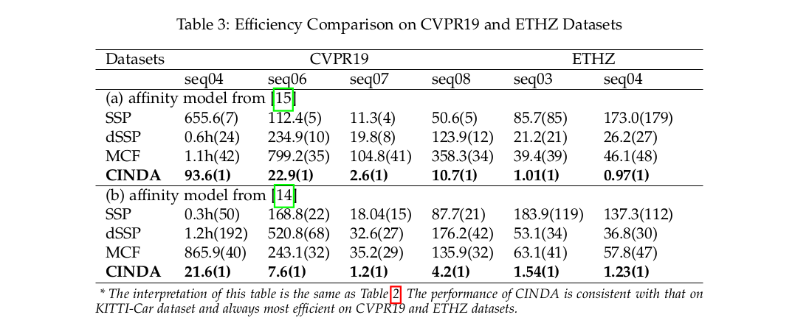
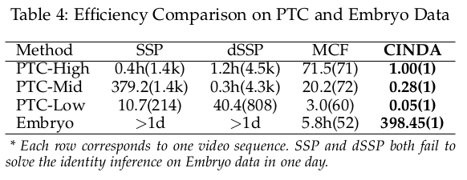
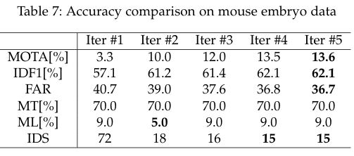

# Welcome to CINDA
CINDA (**Ci**rculation **N**etwork based **D**ata-**a**ssociation) is a minimum-cost circulation framework for solving the global data association problem, which plays a key role in the tracking-by-detection paradigm of multi-object tracking (MOT). CINDA maintains the same optimal solution as the previously widely used minimum-cost flow framework, while enjoys both a better theoretical complexity bound and orders of practical efficiency improvement. The improved computational efficiency is expected to enable more sophisticated tracking framework and yields better tracking accuracy.

Overview of CINDA and its comparison with minmum-cost flow-based framework.
# Supports to Python and MATLAB
CINDA was implemented using C based on the efficient implementation of cost-scaling algorithm [1]. Interfaces for Python and MATLAB are also provided respectively, on which the efficiency is also guaranteed. Try CINDA now!

Any problem? CINDA does not work on your data? Please open an issue. We are happy to help!

# Efficiency comparison
## Theoretical bounds

## Pracitical comparisons
### On natural image benchmars

### On microscopy imaging data for particle and cell tracking

# Case studies using CINDA
## Identity inference using more history frames retrieve identities of occluded objects

## Enable us to iteratively refine tracking results on larger scale data

[1].Goldberg, A. V. (1997). An efficient implementation of a scaling minimum-cost flow algorithm. Journal of algorithms, 22(1), 1-29.
